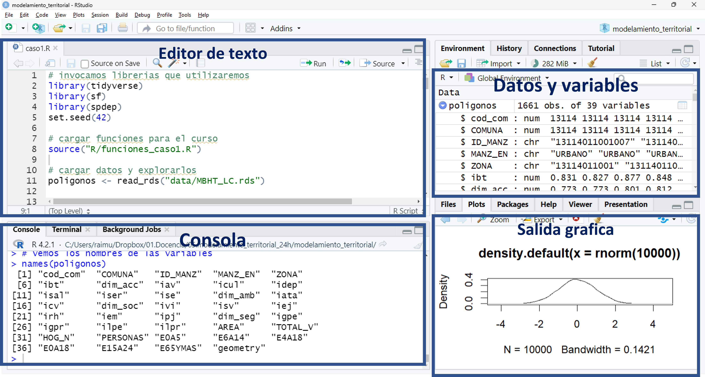
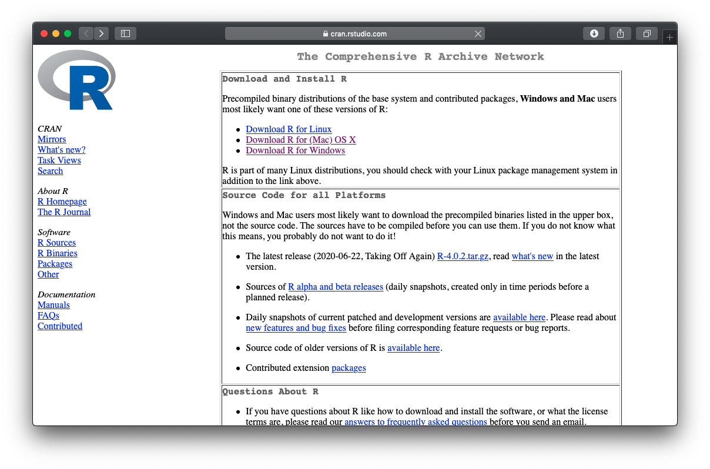
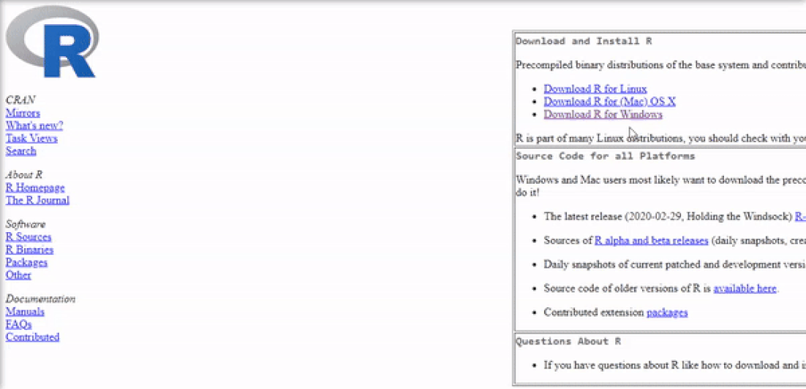
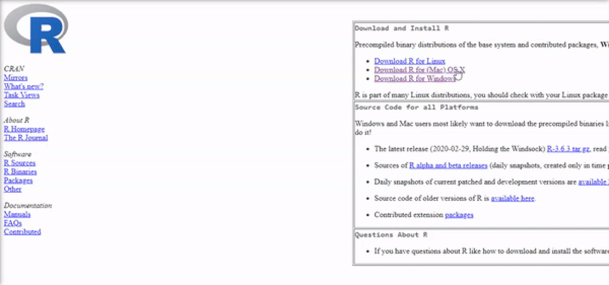
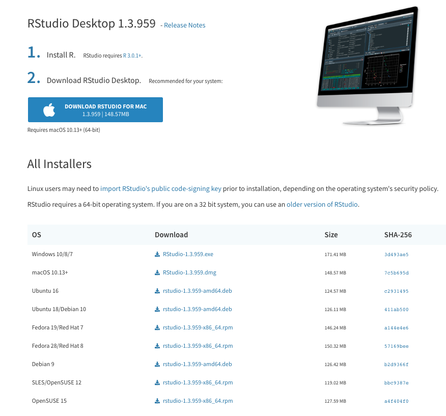
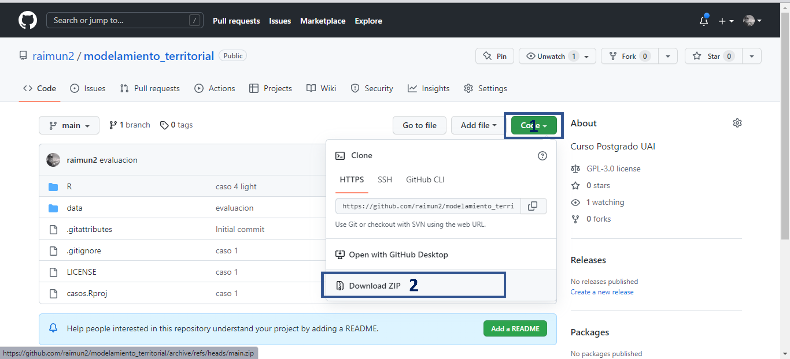
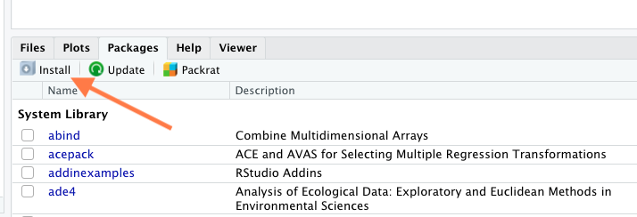

```{r setup, include=FALSE}
knitr::opts_chunk$set(echo = TRUE)
```

### ¿Qué es R?

{width="10%"}


R es un lenguaje de computación estadística (statistical computing), de código abierto y de uso libre. Está diseñado para trabajar con datos, y por lo tanto es una herramienta muy apropiada para trabajar en campos de estudio que se basan en datos o modelos matemáticos, como la economía, las finanzas, la ciencia de datos, el aprendizaje de máquinas, etc.

Al ser un lenguaje de programación, en lugar de una herramienta con una interfaz de usuario, es muy rápido y eficiente para ejecutar cálculos, pero requiere que el usuario tenga una alta capacidad de abstracción para ordenar las tareas en las líneas de código.


### ¿Qué es RStudio? 

RStudio es un editor de código de R open source, y es el más utilizado en el mundo de analistas de datos. Esta herramienta es un ambiente de desarrollo integrado, el cual nos permitirá escribir código de manera más fácil. 

La interfaz de RStudio se divide en 4 cuadrantes:

- Izquierda superior: El editor de código propiamente tal. El código se escribe en archivos de texto plano que tienen extensión .R, de manera de poder reproducir los análisis que vayamos realizando. 

- Derecha superior: Environment, o entorno de trabajo, en este cuadrante se van visualizando todos los datos que vamos utilizando en nuestro análisis. 

- Derecha inferior: Ventana de salida, acá se visualizan los gráficos resultantes de nuestros análisis.

- Izquierda inferior: Consola, acá es donde se muestra el resultado de la ejecución de cada línea de código.


Cabe señalar que cada cuadrante tiene pestañas adicionales con otras funcionalidades. 


<center>{width="90%"}</center>


### Instalación de R

Para instalar R se sugiere hacerlo desde el respositorio CRAN (The Comprehensive R Archive Network) de Rstudio (<https://cran.rstudio.com>) donde solo se debe seleccionar de acuerdo a su sistema operativo, idealmente la última versión. Aquellos que tienen una versión menores de 4.1 se recomienda actualizar a la ultima versión.

En el proceso de instalación se pregunta sobre idioma, cuya decisión es libre, pero recomendamos elegir *inglés* esto cobrará importancia cuando se busque documentación en la web o libros sobre algún eventuales "*warning*" o "*error*".

<center>{width="60%"}</center>


#### Instalación de R para Windows

<center>{width="90%"}</center>


#### Instalación de R para Mac

<center>{width="90%"}</center>


#### Instalación de R para Linux

Para Linux se puede instalar desde la terminal

```{r eval=FALSE}
sudo apt update

sudo apt -y upgrade

sudo apt -y install r-base
```

#### Instalación de RStudio

RStudio puede ser descargado directamente de la su página oficial <https://rstudio.com/products/rstudio/download/#download>, donde se debe seleccionar el sistema operativo que corresponde.

<center>{width="60%"}</center>

Se aconseja revisar las siguiente documentación en el siguiente [link](https://b-rodrigues.github.io/modern_R/getting-to-know-rstudio.html), donde se explicativa diferentes paneles de Rstudio de manera gráfica.


### R Projects

Los R Projects son estructuras de proyecto dentro de RStudio y permiten tener el codigo, los datos y los resultados ordenados en un mismo directorio de trabajo.

Para este curso vamos a descargar un proyecto desde esta misma pagina haciendo click en Code y luego en Download ZIP. Una vez descargada la carpeta ZIP, descomprimala en su computador y abra el archivo del proyecto, llamado modelamiento_territorial.Rproj. Esto abrira RStudio y podremos comenzar a trabajar.

<center>{width="60%"}</center>


### Instalar Librerías

Las librerías o paquetes en R corresponden a una colección de funciones encapsuladas y diseñadas para atender una tarea específica. Por ejemplo, hay paquetes para visualización, o para analisis geoespacial, o análisis psicométricos, mineria de datos, interacción con servicios de internet y muchas otras cosas más.

Estos paquetes se encuentran alojados principalmente en [CRAN](https://cran.r-project.org) (Comprehensive R Archive Network), así que pasan por un control riguroso antes de estar disponibles para su uso generalizado. En el siguiente enlace se deja una lista de temas y sus librerías asociadas disponibles, con una breve descripción ([enlace](https://cran.r-project.org/web/views/))

Aunque otras librerías no oficiales pueden estar disponible en [Github](https://github.com) de cada autor.

Podemos instalar paquetes usando la función `install.packages()`, dando como argumento el nombre del paquete que deseamos instalar, entre comillas.

Para instalar librerías se puede hacer directamente desde la consola de RStudio, por ejemplo:

```{r eval=FALSE}
# Se puede instalar más de una librería a la vez
install.packages(c("dplyr", "ggplot2", "tidyverse", "sf", "MASS", 
                   "gstat", "raster", "spdep", "spatialreg", 
                   "patchwork", "tidygeocoder", "mapview", "osmdata"))

```

También se pude instalar librerías del Panel "Packages"

<center>{width="90%"}</center>

### Ejecutar codigo

Para ejecutar una línea de código debe seleccionarla y apretar Ctrl+Enter

Al hacerlo se vera la instrucción en la consola. Algunas líneas de código modifican o crean variables, y otras líneas de código generan directamente un output, imprimiendo en la consola el resultado o generando algún grafico


```{r eval=FALSE}

# esto es un comentario 
# los comentarios van en el codigo pero no se ejecutan
# sirven para ir señalando que hace cada linea de codigo

# aca creamos una variable y almacenamos en ella el resultado de una operacion simple
resultado_de_una_suma = 3 + 5

# imprimimos el valor almacenado en esta variable
print(resultado_de_una_suma)

# ploteamos 
plot(resultado_de_una_suma)

```


### Referencias

Página Web Oficial R <https://www.r-project.org>\
Página Rstudio <https://rstudio.com>\
Pagina libro de R para Data Science <https://es.r4ds.hadley.nz/>\